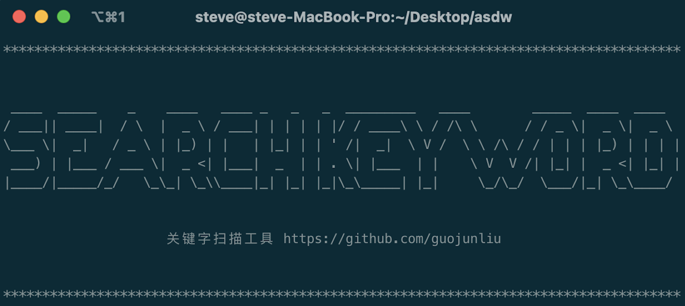
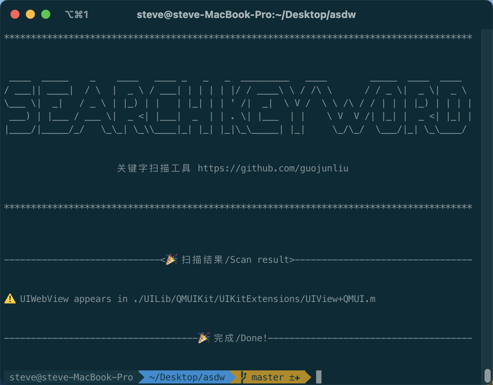
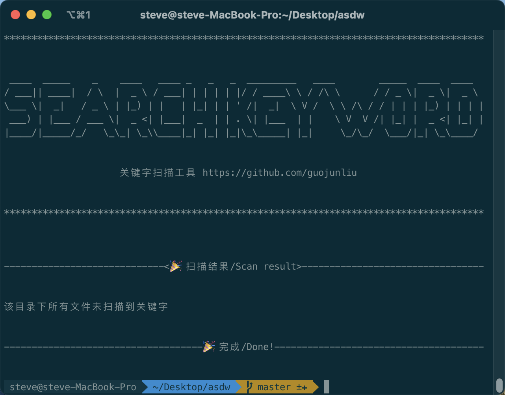

# searchkeyword



[](https://github.com/guojunliu/homebrew-searchkeyword/blob/master/LICENSE)
[](https://github.com/guojunliu/homebrew-searchkeyword)
[](https://github.com/guojunliu/homebrew-searchkeyword)
[](https://github.com/guojunliu/homebrew-searchkeyword/raw/master/product/1.0.0/searchkeyword_1.0.0.tar.gz)
[](https://github.com/guojunliu/homebrew-searchkeyword)
[](https://github.com/guojunliu/homebrew-searchkeyword)


## 介绍

Mac下扫描文件夹中所有文件是否包含关键字的工具

## 安装

需要提前安装[Homebrew](https://brew.sh/)，然后在终端中运行以下代码

`brew install guojunliu/searchkeyword/searchkeyword`


## 使用

```
searchkeyword [keyword]

示例：
searchkeyword UIWebView
```

## 扫描结果

- 扫描到关键字

	

- 未扫描到关键字

	